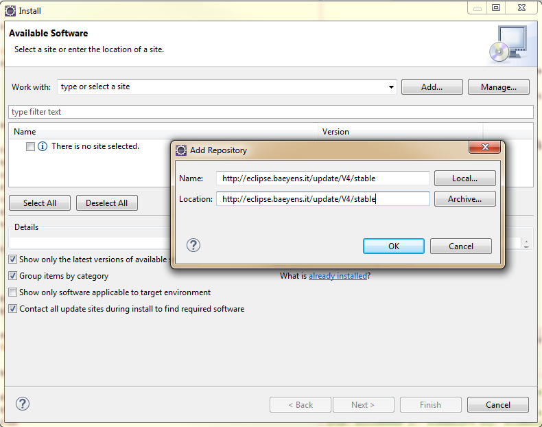
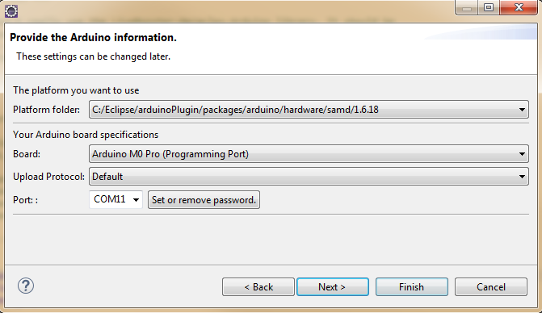
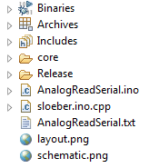
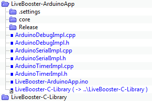

# Arduino

The Arduino environment on Eclipse IDE can be used to make an application for several devices board type (**Arduino M0 Pro**, **Arduino Mega ADK**, **ChipKIT uc32**, ...)

## Environment

### Install application

Clone the LiveBooster Library and examples from [Github]() **(*TBD*)** to a local directory :


***LiveBooster-C-Library*** is common for all platforms and environment.
Only ***LiveBooster-C-Library*** and ***LiveBooster-ArduinoApp*** directories are used to build application.

### Eclipse IDE

Eclipse has been chosen instead of Arduino IDE for the following reason:
* supports additional libraries in sub-directory,
* easier navigation in the coding,
* easier refactoring
* ...

**Prerequisites:** Eclipse installed on PC.

#### Arduino plugin

Add [Arduino plugins](http://eclipse.baeyens.it/update/V4/stable/) from [url](http://eclipse.baeyens.it/stable.php?OS).

**Help** -> **Install New Software …** -> **Add** -> ….. -> **OK**



#### Create Arduino project
##### sample project
**File** → **new** → **Project...** → **menu Arduino** → select **Arduino Sketch** → **Next**
Define the project name `LiveBooster-ArduinoApp` → **Next**
Update the platform



→ **Next** and select a template model


→ **Finish**

The following files are created in the project LiveBooster-Arduino



Remove the files .ino, .txt, .png

Add a symbolic link on `LiveBooster-C-Library` directory.
*In System cmd executed as administrator :*
**`cd ...../LiveBooster/LiveBooster-ArduinoApp`**
**`mklink /D "LiveBooster-C-Library" "..\LiveBooster-C-Library"`**

Create the main file : [LiveBooster-ArduinoApp.ino](..\LiveBooster-ArduinoApp\LiveBooster-ArduinoApp.ino)
Create the implementation files for debug, serial timer :
* [ArduinoDebugImpl.h](..\LiveBooster-ArduinoApp\ArduinoDebugImpl.h)
* [ArduinoDebugImpl.cpp](..\LiveBooster-ArduinoApp\ArduinoDebugImpl.cpp)
* [ArduinoSerialImpl.h](..\LiveBooster-ArduinoApp\ArduinoSerialImpl.h)
* [ArduinoSerialImpl.cpp](..\LiveBooster-ArduinoApp\ArduinoSerialImpl.cpp)
* [ArduinoTimerImpl.h](..\LiveBooster-ArduinoApp\ArduinoTimerImpl.h)
* [ArduinoTimerImpl.cpp](..\LiveBooster-ArduinoApp\ArduinoTimerImpl.cpp)

##### Final project



#### Compilation

Select the main file [LiveBooster-ArduinoApp.ino](..\LiveBooster-ArduinoApp\LiveBooster-ArduinoApp.ino)

**Mandatory :**
Add the following instruction in the **setup** function to solve the **sscanf** primitive primitive with a "**%f**" tag to convert string to float value.

```c
   asm(".global _printf_float");
```

Then check that the project compile.


#### Upload to device
Tansfert the application on the device (compilation + upload)


## IOT device board

### Arduino M0 Pro
Specificities of Arduino M0 Pro are described [here](ArduinoM0Pro.md).


### ChipKIT uc32
Specificities of ChipKIT uc32 are described [here](ChipKITuc32.md).
