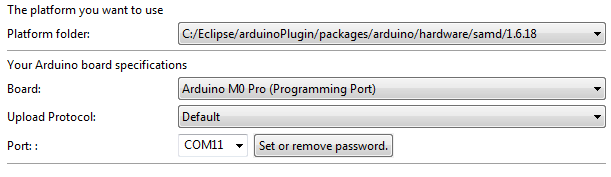

# Arduino M0 Pro


## Board description

See http://www.redohm.fr/2016/02/carte-arduino-m0-pro/ for characteristics.

## Heracles modem
[Heracles shield](HeraclesShield.md) is used to connect the device to the Live Objects platform via a MQTT connection.


## Pins configuration

Pins configuration :
 * Pins **SERIAL_TX**, **SERIAL_RX** used to be linked to the PC (**USB programming**).
 * Pins **D1** (Serial1_TX),  **D0** (Serial1_RX) used to be linked to Heracles board.
 * Pin **D4** set to HIGHT (**reset** of Heracles shield board).


*Example software  to use serial line*

```c
#include "Arduino.h"

#define HeraclesSerial Serial1

const int  Rst = 4;

void setup() {
    /* initialize the Rst signal as an output: */
    pinMode(Rst, OUTPUT);
    digitalWrite(Rst, HIGH);

    /* Open serial communication and wait for port to open */
    Serial.begin(115200);
    while (!Serial) {
    ; // wait for serial port to connect. Needed for native USB port only
    }
    Serial.println("TEST AT COMMANDS WITH HERACLES MODEM !");

    /* Set the data rate for the HeraclesSerial port */
    HeraclesSerial.begin(115200);
    HeraclesSerial.println("AT\r\n");
}

void loop() {
       if (HeraclesSerial.available()) {
        Serial.write(HeraclesSerial.read());
    }
    if (Serial.available()) {
          HeraclesSerial.write(Serial.read());
    }
}
```
## Required hardware

* Arduino M0 Pro board.
* Heracles Modem shield.
* Battery Lithium-ion 3.7V for Heracles Modem shield.
* 1 micro-USB cable.

## Required software

* Eclipse IDE to develop application.
* Serial port monitor.
* [LiveObjects account](http://liveobjects.orange-business.com).

## Building the sample

To build the sample application:

1. Plug the Heracles modem shield on the Arduino M0 Pro.
1. Set the jumper Rx/Tx jumper on Other on Heracles modem shield (use pin **Rx** and **Tx**).
1. Plug the micro-USB cable into the **programming USB** and PC.
1. Clone the LiveBooster repository from [gitHub]() *(TBD)* in a local directory.
1. Create a project on Eclipse as defined in [ArduinoApplication](ArduinoApplication.md)
1. Configure Eclipse to compile and upload the application on Arduino board :



7. Compile and upload the Example application (button **Upload Sketch**)
1. The board is automatically programmed with the new binary. A flashing LED on it indicates that it is still working. When the LED stops blinking, the board is ready to work and the application start.
1. Start the serial port monitor and configure **COM***xx*, (115200,8,None,1).
1. Press the **RESET** button on the board to restart the program. A trace of the connection to LiveObject is displayed to the terminal emulator.
1. Connect to the [LiveObjects](http://liveobjects.orange-business.com) platform. Select **parc**, select **Manage/MQTT**. Verify than the Auto-created device **urn:lo:nsid:LiveBooster:test** is connected.
