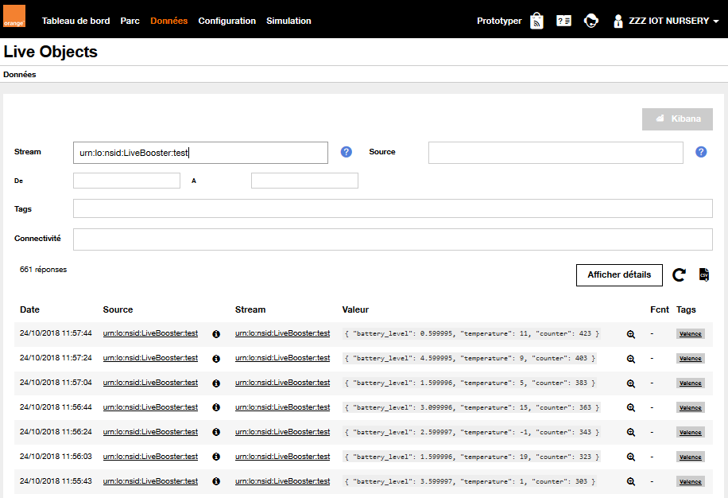
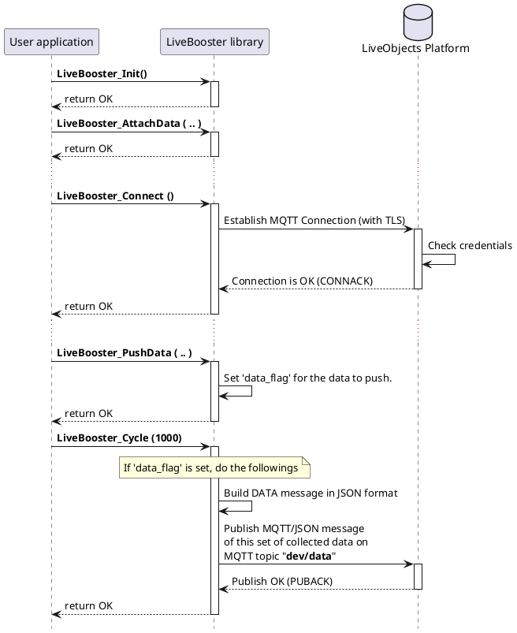

# Collected Data

The device can declare a set of collected data (one or several parameters) to publish to LiveObject.

# Attach a set of data
Application shall declare/attach one set of collected data to the LiveBooster library by calling the function:

```c
int LiveBooster_AttachData(
     	const char* stream_id,
		const char* model,
		const char* tags,
		const char* timestamp,
		const LiveBooster_GpsFix_t* gps_ptr,
		const LiveBooster_Data_t* data_ptr,
		int32_t data_nb);
```
Notes:
The ***model***, ***tags***, ***timestamp***, ***gps_ptr*** parameters are optionals (can be set to ***NULL*** in the called function).
By default, a maximum of five set of collected data can be defined for a device.
*(Modify the parameter LB_MAX_OF_DATA_SET in Libebooster_config.h file to change this number).*

In the sample application:

```c
appv_hdl_data = LiveBooster_AttachData(deviceId, "mV1", "\"Valence\"", NULL,
        			      &gpsData, appv_set_measures, SET_MEASURES_NB);
```
Where:
1. The "appv_set_measures" parameter is defined by an array of LiveBooster_Data_t elements.
2. The returned parameter *appv_hdl_data* is the handler id  of a set of collected data.

In the sample application:

```c
// Set of Collected data (published on a data stream)
LiveBooster_Data_t appv_set_measures[] = {
  { LB_TYPE_UINT32, "counter" ,        &appv_measures_counter, 1 },
  { LB_TYPE_INT32,  "temperature" ,    &appv_measures_temp, 1 },
  { LB_TYPE_FLOAT,  "battery_level" ,  &appv_measures_volt, 1 }
};
#define SET_MEASURES_NB (sizeof(appv_set_measures) / sizeof(LiveBooster_Data_t))
```

And the set of collected data may be defined and initialized as:

```c
// Contains a counter incremented after each data sent
uint32_t appv_measures_counter = 0;

// Contains the temperature level
int32_t  appv_measures_temp = 20;

// Contains the battery level
float    appv_measures_volt = 5.0;
```

## Push a set of collected data
The application declares the LiveBooster_PushData function to publish data (publishing a MQTT message on the dev/data topic) to the LiveObject platform, cyclically or not and at a frequency defined by the user.

```c
int LiveBooster_PushData(int handle);
```

In the sample application:

```c
res = LiveBooster_PushData(appv_hdl_data);

```




## Sequence diagram


