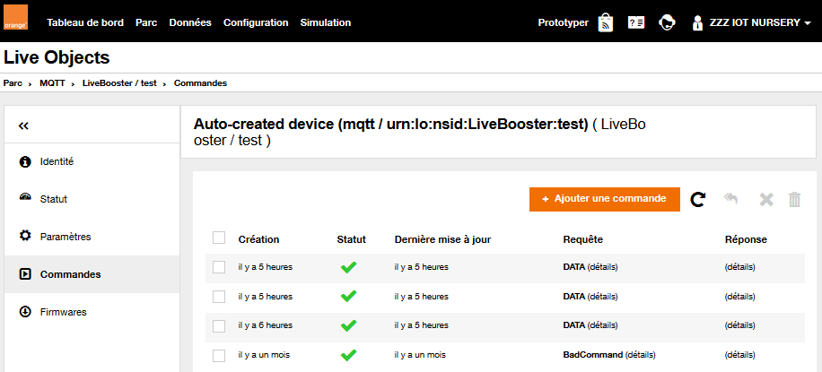
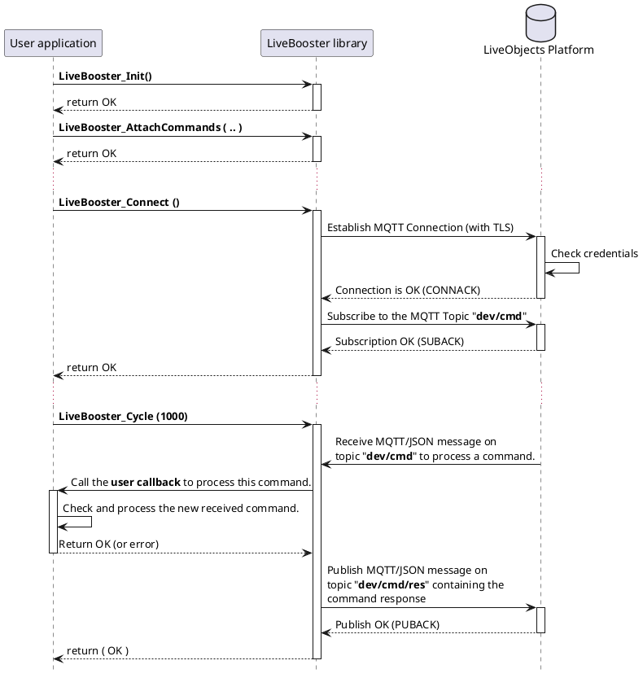

# Commands

The device can declare one or several Live Objects "commands".

Live Objects allow users to set different target values for those commands. Live Objects will then send the commands to the device once it's connected and available.

## Attach a set of command
The application shall declare/attach only one set of commands to the LiveBooster library by calling the function:

```c
int LiveBooster_AttachCommands (const LiveBooster_Command_t* ptrCmd,
                                int32_t nbCcmd,
                                LiveBooster_CallbackCommand_t callback);
```

In the sample application:

```c
res = LiveBooster_AttachCommands(setOfcommands, SET_COMMANDS_NB, mainCommand);
```
Where:
1. The set of commands is defined by an array of *LiveBooster_Command_t* elements.

In the sample application:

```c
// definition of identifier for each kind of commands
#define CMD_IDX_RESET 1
#define CMD_IDX_DATA 2

// Set of configuration parameters
LiveBooster_Command_t setOfcommands[] = {
{ CMD_IDX_RESET, "RESET", 0 },
{ CMD_IDX_DATA, "DATA", 0 }
};
#define SET_COMMANDS_NB (sizeof(setOfcommands) / sizeof(LiveBooster_Command_t))
```

And the commands may be defined and initialized as:

```c
typedef struct  {
	int ToPublish;
	unsigned int PeriodInMs;
} Data_t;

#define NOT_PUBLISH_DATA 0
#define PUBLISH_DATA 1

static Data_t Data = {NOT_PUBLISH_DATA, 60000};
```

2. The application specifies the callback function (of type *LiveBooster_CallbackParams_t*) which will be called by the LiveBooster library when a command is received from Live Objects.

```c
int mainCommandCb (const LiveBooster_CommandRequestBlock_t *pCmdReqBlk) {

    int res= OK;
    const LiveBooster_Command_t*  cmd_ptr;

    if ((pCmdReqBlk == NULL) || (pCmdReqBlk->hd.cmd_ptr == NULL) || (pCmdReqBlk->hd.cmd_cid == 0) ) {
      return REFUSE;
    }

    cmd_ptr = pCmdReqBlk->hd.cmd_ptr;

	switch (cmd_ptr->cmd_uref) {
		case CMD_IDX_RESET: {
	        ...
			break;
		}
		case CMD_IDX_DATA: {
	        ...
			break;
		}
	}
	return res;
}
```

With the Switch statement you can adapt the behavior of your application for each command.

Notes:
 The user callback checks the arguments of the commands and returns OK (0) to accept the new command or return an error if the command is rejected :
 * -1 : "Invalid",
 * -2 : "Bad format",
 * -3 : "Not supported",
 * -4 : "Not processed".

## Push a command response
 The LiveBooster library notifies the Datavenue Live Objects platform, by publishing a MQTT message on the dev/cmd/res topic, that the command is acknowledged.

## Use of Live Objects Portal to set/change commands
On the Datavenue Live Objects portal, the user can create or repeat a "Command" for its connected device:



## Sequence diagram


