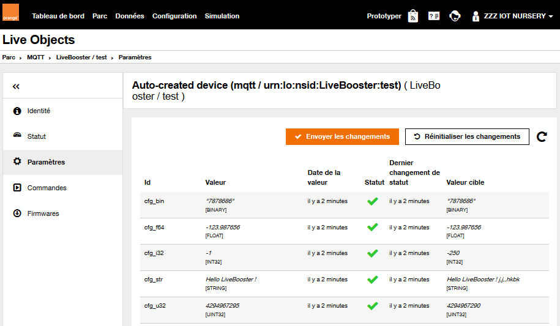
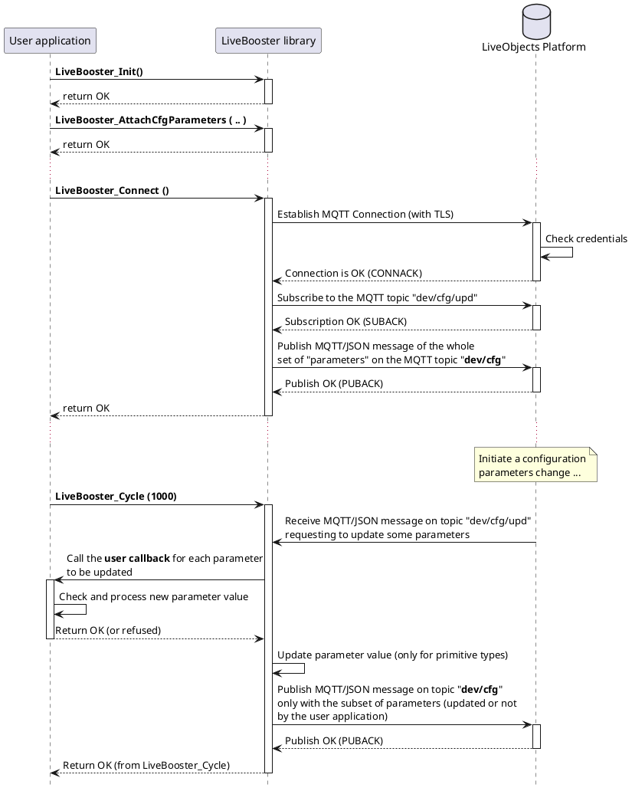

# Configuration Parameters

A device can declare one or several Live Objects "parameters" to configure it.

Then, Live Objects can track the changes of the current values of the parameters, and allow the users to set different values for those parameters. Live Objects will update the parameters on the device once it's connected and available.

## Attach a set of configuration parameters
An application shall declare/attach only one set of configuration parameters to the LiveBooster library by using the function:

```c
int LiveBooster_AttachCfgParameters(
		const LiveBoosterD_Param_t *param_ptr,
		int32_t param_nb,
		LiveBooster_CallbackParams_t callback);
```

In the sample application:

```c
res = LiveBooster_AttachCfgParameters(appv_set_param, SET_PARAM_NB, main_cb_param_udp);
```

Where:
1. The set of "parameters" data is defined by an array of LiveBooster_Param_t elements.
In the sample application:
*The number of parameters is not limited as long as there is enough memory on the board.*
```c
// definition of identifier for each kind of parameters
#define PARM_IDX_CFG_STR 1
#define PARM_IDX_CFG_I32 2
#define PARM_IDX_CFG_U32 3
#define PARM_IDX_CFG_F64 4
#define PARM_IDX_CFG_BIN 5

/// Set of configuration parameters
LiveBooster_Param_t setOfParam[] = {
{ PARM_IDX_CFG_STR, { LB_TYPE_STRING_C, "cfg_str" , appv_conf.cfg_str } },
{ PARM_IDX_CFG_I32, { LB_TYPE_INT32, "cfg_i32" , &appv_conf.cfg_i32 } },
{ PARM_IDX_CFG_U32, { LB_TYPE_UINT32, "cfg_u32", &appv_conf.cfg_u32 } },
{ PARM_IDX_CFG_F64, { LB_TYPE_FLOAT, "cfg_f64" , &appv_conf.cfg_f64 } },
{ PARM_IDX_CFG_BIN, { LB_TYPE_BIN, "cfg_bin" , appv_conf.cfg_bin } }
};
#define SET_PARAM_NB (sizeof(setOfParam) / sizeof(LiveBooster_Param_t))
```

And the configuration parameters may be defined and initialized as:

```c
typedef struct  {
	char cfg_str[20];
	long int cfg_i32;
	unsigned long int cfg_u32;
	float cfg_f64;
	char cfg_bin[400];
} ParamSet_t;

ParamSet_t appv_conf = { "Hello LiveBooster !", -1, 4294967295,  -123.987654321, "7878686"};
```

2. The application specifies the callback function (of type LiveBooster_CallbackParams_t) which will be called by the LiveBooster library when a request is received from the Live Objects platform to change the value of the parameter.

```c
int paramUdpdateCb (const LiveBooster_Param_t *ptrParam, const void *value, int len) {

	int paramIsOk = true;

	if (ptrParam == NULL) {
		return REFUSE;
	}
	switch (ptrParam->parm_uref) {
		case PARM_IDX_CFG_STR: {
		    ...
		    strcpy(appv_conf.cfg_str,(const char*)value);
			if (paramIsOk) {
				return OK;
			}
			break;
		}
		case PARM_IDX_CFG_I32: {
			...
			if (paramIsOk) {
				return OK;
			}
			break;
		}
	case PARM_IDX_CFG_U32: {
		   ...
			if (paramIsOk) {
				return OK;
			}
			break;
		}
	case PARM_IDX_CFG_F64: {
	      ...
			if (paramIsOk) {
				return OK;
			}
			break;
	    }
	case PARM_IDX_CFG_BIN: {
	    ...
	    strcpy(appv_conf.cfg_bin,(const char*)value);
		if (paramIsOk) {
			return OK;
		}
		break;
	    }
	}
	return REFUSE;
}
```

With the Switch statement you can adapt the behavior of your application for each parameter.

Notes:
 * When the user callback returns OK (0) to accept the new value for a primitive parameter (integer, float, ...), the LiveBooster library updates the value of this configuration parameter. But for a "string" or "binary" parameters, the user application has to copy the value in the correct memory place (with the correct size).
 * The "parameters" data will be automatically pushed as soon as the MQTT connection is established with the LiveObjects platform.

## Push a set of configuration parameters
The LiveBooster library notifies the Datavenue Live Objects platform, by publishing a MQTT message on the **dev/cfg topic**, that the current configuration is updated.

## Use of Live Objects Portal to set/change parameters
On the Datavenue Live Objects portal, the user can check the "Parameters" of the device and also change these initial values:



## Sequence diagram


