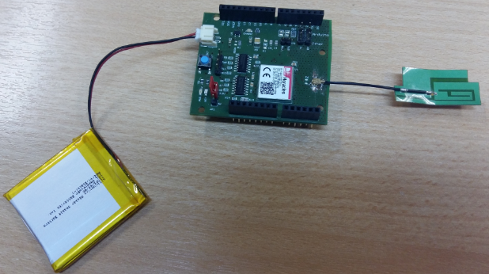
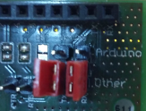
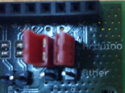
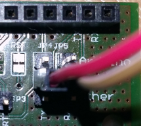
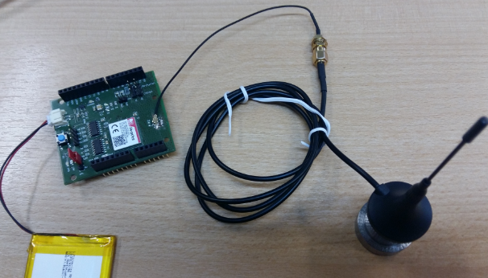

# Heracles Shield

This shield is used to connect the device to the Live Objects platform via a MQTT connection.
This shield communicates with the device board via a RS link.

## Board description

This board is a shield compatible with Arduino boards.
It contains an Heracles modem sim800 (see doc [**SIM800_Hardware Design_V1.08.pdf**](https://simcom.ee/documents/SIM800/SIM800_Hardware%20Design_V1.08.pdf)).

This shield must be used with a 3.7V Lithium-ion battery to absorb the voltage spikes during RS emission.
An antenna is needed to improve the wireless transmission.

## Firmware
The firmware used is **1418B04HeraclesM32**.
The firmware version can be checked with the command `AT+GMR`

## Pins configuration

The Heracles Modem exchange data with a target board via a RS link (Connector **JP4** and **JP5**)
The default RS link configuration is : 115200 baud, 8 bit data, None Parity, 1 bit stop.

In the following configuration (strap on ***Others***)
 * **TX** is connected to **D1** of the used target board.
 * **RX** is connected to **D0** of the used target board.

In the following configuration (strap on ***Arduino***)
 * **TX** is connected to **D3** of the used target board.
 * **RX** is connected to **D2** of the used target board.

In the following configuration (no strap, use cable on central pin TX/RX)
 * **TX** is connected to **other** pin TX of the used target board.
 * **RX** is connected to **other** pin RX of the used target board.

## AT commands

See the following documents for AT commands :
* [**SIM800 Series_AT Command Manual_V1.10.pdf**](https://github.com/lizard43/cell/blob/master/docs/SIM800%20Series_AT%20Command%20Manual_V1.10.pdf).
* [**SIM800 Series_SSL_Application Note_V1.02.pdf**](https://simcom.ee/documents/SIM800x/SIM800%20Series_SSL_Application%20Note_V1.02.pdf).

## Communication failure

When the MQTT connection between the device and Live Objects platform failed, several possibilities can be analyzed:
* Low level of the 3.7V Lithium-Ion battery, wait a little after power it on and reset the application to restart.  
* The RS speed (115200 bauds) is excessive on the serial link between the Heracles modem board and the device board, in this case: reduce the speed of the RS link on the device board (38400 bauds).
* The wireless transmission is bad, in this case use a better external antenna.
* The amount of exchanged data has reached the prepaid data plan threshold.

