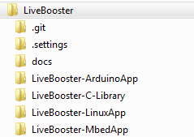
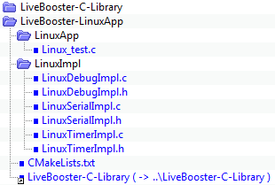
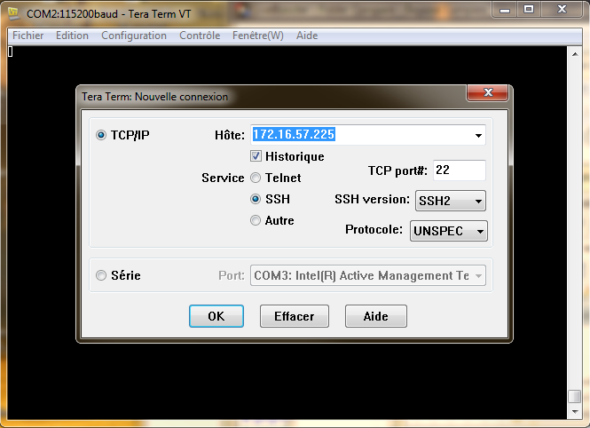
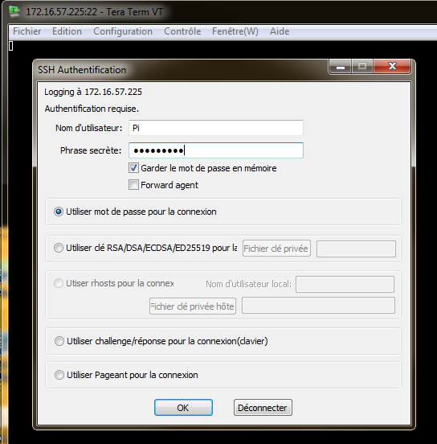

# Linux

The Linux environment can be used to make an application for several devices board type (**Raspberry Pi 3**, **Udoo Neo**, ...)

## Environment

### Install application

Clone the LiveBooster Library and examples from [Github]() **(*TBD*)** to a local directory :

*LiveBooster-C-Library* is common for all platforms and environment.
Only ***LiveBooster-C-Library*** and ***LiveBooster-LinuxApp*** directories are used to build application.

### Linux environment

The Linux environment is prepared on Windows to facilitate the Configuration management. Then, the environment (directories, files) is transfered to the Linux board with WinSCP. The compilation and execution of the Linux application is made on the Linux device board.

#### Tools installation

1. Install [Teraterm](https://www.clubic.com/telecharger-fiche10398-tera-term-pro.html).
1. Install [Winscp](https://winscp.net/eng/download.php).
Load version *WinSCP 5.13*.
Execute the file *WinSCP-5.13.3-Setup.exe*.

#### Create Linux project

Create a directory to prepare the Linux application

Add a symbolic link [LiveBooster-C-Library](..\LiveBooster-LinuxApp\LiveBooster-C-Library).
*In console executed as administrator :*
**`mklink /D "LiveBooster-C-Library" "..\LiveBooster-C-Library"`**

Copy the directory **LinuxApp** and **LinuxImpl** and the [CMakeLists.txt](..\LiveBooster-LinuxApp\CMakeLists.txt) file from the ***LiveBooster-LinuxApp*** directory.

**LinuxApp** directory contains the main file [Linux_test.c](..\LiveBooster-LinuxApp\LinuxApp\Linux_test.c)

**LinuxImpl** contains the implementation files for debug, serial timer :
* [LinuxDebugImpl.h](..\LiveBooster-LinuxApp\LinuxImpl\LinuxDebugImpl.h)
* [LinuxDebugImpl.c](..\LiveBooster-LinuxApp\LinuxImpl\LinuxDebugImpl.c)
* [LinuxSerialImpl.h](..\LiveBooster-LinuxApp\LinuxImpl\LinuxSerialImpl.h)
* [LinuxSerialImpl.c](..\LiveBooster-LinuxApp\LinuxImpl\LinuxSerialImpl.c)
* [LinuxTimerImpl.h](..\LiveBooster-LinuxApp\LinuxImpl\LinuxTimerImpl.h)
* [LinuxTimerImpl.c](..\LiveBooster-LinuxApp\LinuxImpl\LinuxTimerImpl.c)

##### Final project

#### Transfert project to a Linux device board

1. Open **WinSCP** and establish a connection to the Linux Device.

*Refer to [IOT device board](#iot-device-board) for IP , User Name and Password*.

2. On **WinScp**, select the Origin directory on Windows (**LiveBooster-LinuxApp**) and the Destination directory on the Linux platform (**LiveBooster**).
1. Select the directories and files to transfer.

4. Clic on the **Envoyer** button.

#### Compilation

1. Open **Teraterm** and open a new connection

1. Then clic **Fichier** -> **Nouvelle connexion ...** -> Select **TCP/IP** -> update Hote

-> **OK**

3. Enter Username and Password

-> **OK**

4. Goto **LiveBooster** directory **LiveBooster**

1. Create a directory named **build** and go into it.

1. Generate the makefile
**`cmake ..`**

7. Compile or recompile application *(the application must be clean before each recompilation)*.
**`make clean; make`**

8. Run application
**`bin/Linux_test`**

## IOT device board

### Raspberry pi 3
Specificities of Raspberry pi 3 are described [here](RaspberryPi3.md).

### UDOO Neo
Specificities of UDOO Neo are described [here](UdooNeo.md).
