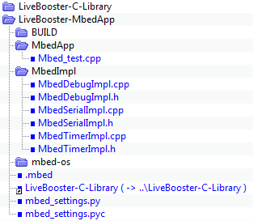

# Mbed

The Mbed environment can be used to make an application for several devices board type (**NUCLEO_F746ZG**, **NUCLEO_L476RG**, ...)

## Environment

### Install application

Clone the LiveBooster Library and examples from [Github]() **(*TBD*)** to a local directory :


*LiveBooster-C-Library* is common for all platforms and environment.
Only ***LiveBooster-C-Library*** and ***LiveBooster-MbedApp*** directories are used to build application.

### Mbed environment

#### Tools installation

1. Install [Python 2.7.15 Windows x86-64 MSI installer](https://www.python.org/downloads/release/python-2715/) (with privilege administrator).
1. Install [TortoiseHg (including Mercurial) 4.6.1 - x64 Windows](https://tortoisehg.bitbucket.io/)
1. Install [GNU ARM Embedded Toolchain](https://developer.arm.com/open-source/gnu-toolchain/gnu-rm/downloads) (if not already made).
1. Install [Git](https://git-scm.com/downloads) (if not already made).


***Verify the installation of the installed component***
Open a command console.
Create a **C:\Users\<user>\ARM** directory.
Input the following commands:

```
C:\Users\JWDR6323\ARM>gcc --version
gcc (i686-posix-dwarf-rev0, Built by MinGW-W64 project) 8.1.0
Copyright (C) 2018 Free Software Foundation, Inc.
This is free software; see the source for copying conditions.  There is NO
warranty; not even for MERCHANTABILITY or FITNESS FOR A PARTICULAR PURPOSE.
```
```
C:\Users\JWDR6323\ARM>python --version
Python 2.7.15
```
```
C:\Users\JWDR6323\ARM>arm-none-eabi-gcc --version
arm-none-eabi-gcc (GNU Tools for ARM Embedded Processors) 4.8.4 20140725 (release) [ARM/embedded-4_8-branch revision 213147]
Copyright (C) 2013 Free Software Foundation, Inc.
This is free software; see the source for copying conditions.  There is NO
warranty; not even for MERCHANTABILITY or FITNESS FOR A PARTICULAR PURPOSE.
```
```
C:\Users\JWDR6323\ARM>git --version
git version 2.16.2.windows.1
```
```
C:\Users\JWDR6323\ARM>hg --version
Mercurial Distributed SCM (version 4.6.1)
(see https://mercurial-scm.org for more information)

Copyright (C) 2005-2018 Matt Mackall and others
This is free software; see the source for copying conditions. There is NO
warranty; not even for MERCHANTABILITY or FITNESS FOR A PARTICULAR PURPOSE.
```
```
C:\Users\JWDR6323\ARM>git --version
git version 2.16.2.windows.1
```
```
C:\Users\JWDR6323\ARM>pip --version
pip 9.0.3 from c:\python27\lib\site-packages (python 2.7)
```

When all these checks are OK, install The **Mbed  client**.

```
C:\Users\JWDR6323\ARM>pip install mbed-cli
Collecting mbed-cli
  Downloading https://files.pythonhosted.org/packages/2e/b6/9c5112f682fbb0dc516e9e29cb16fcc7a9ce8482d0e7fe5c8d463948a313/mbed-cli-1.7.3.zip (60kB)

  100% |################################| 61kB 1.2MB/s

Installing collected packages: mbed-cli
  Running setup.py install for mbed-cli ... done
Successfully installed mbed-cli-1.7.3

You are using pip version 9.0.3, however version 10.0.1 is available.
You should consider upgrading via the 'python -m pip install --upgrade pip' command.
```
```
C:\Users\JWDR6323\ARM>mbed --version
1.7.3
```

#### Create Mbed project

Create a directory to build the application
In this directory, import mbed project to create the mbed library and environment.

For example :
```
mbed import https://os.mbed.com/teams/ST/code/Nucleo_printf/
```
If the process does not end, kill the process **mbed.exe** then launch the command ***mbed new***.

Remove the file main.cpp of the example.
Add a symbolic link [LiveBooster-C-Library](..\LiveBooster-MbedApp\LiveBooster-C-Library).
*In System cmd executed as administrator :*
**`mklink /D "LiveBooster-C-Library" "..\LiveBooster-C-Library"`**


Copy the directory **MbedApp** and **MbedImpl** from the ***LiveBooster-MbedApp*** directory.

**MbedApp** directory contains the main file [Mbed_test.cpp](..\LiveBooster-MbedApp\MbedApp\Mbed_test.cpp)


**MbedImpl** contains the implementation files for debug, serial timer :
* [MbedDebugImpl.h](..\LiveBooster-MbedApp\MbedImpl\MbedDebugImpl.h)
* [MbedDebugImpl.cpp](..\LiveBooster-MbedApp\MbedImpl\MbedDebugImpl.cpp)
* [MbedSerialImpl.h](..\LiveBooster-MbedApp\MbedImpl\MbedSerialImpl.h)
* [MbedSerialImpl.cpp](..\LiveBooster-MbedApp\MbedImpl\MbedSerialImpl.cpp)
* [MbedTimerImpl.h](..\LiveBooster-MbedApp\MbedImpl\MbedTimerImpl.h)
* [MbedTimerImpl.cpp](..\LiveBooster-MbedApp\MbedImpl\MbedTimerImpl.cpp)

##### Final project


#### Compilation
Open a console.
Go to the Mbed application directory.
Define the Toolchain.

**`mbed toolchain GCC_ARM`**

Define the target

**`mbed target NUCLEO_F746ZG`**

Compile the application

**`mbed compile`**

#### Upload to the device

From an explorer, drag and drop **....\BUILD\NUCLEO_F746ZG\GCC_ARM\LiveBooster-MbedApp.bin** to the **NODE_F746ZG (F:)** drive.

## IOT device board

### NUCLEO F746ZG
Specificities of NUCLEO F746ZG are described [here](NucleoF746zg.md).

### NUCLEO L476RG
Specificities of NUCLEO L476RG are described [here](NucleoL476rg.md).
