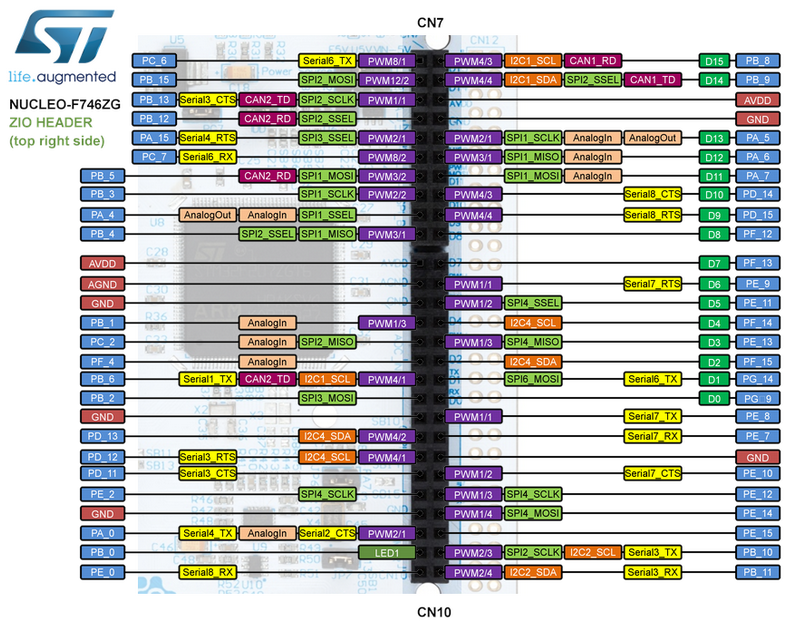
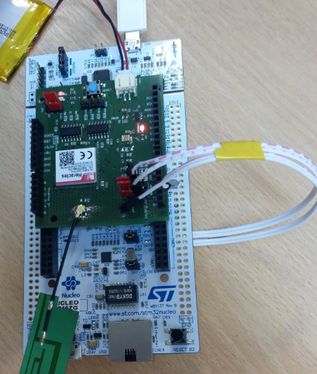

# NUCLEO F746ZG


## Board description

See https://os.mbed.com/platforms/ST-Nucleo-F746ZG/ for characteristics.

## Heracles modem
[Heracles shield](HeraclesShield.md) is used to connect the device to the Live Objects platform via a MQTT connection.


## Pins configuration

Pins configuration :
 * Pins **SERIAL_TX**, **SERIAL_RX** used to be linked to the PC (**USB PWR**).
 * Pins **PE_8** (Serial7_TX),  **PE_7** (Serial7_RX) used to be linked to Heracles board.
 * Pin **D4** set to HIGHT (**reset** of Heracles shield board).

 


*Example software to use for the serial line*

```c
#include "mbed.h"

DigitalOut Pin4(D4);

Serial Heracles(PE_8,PE_7,115200);
Serial Pc(SERIAL_TX,SERIAL_RX,115200);

int main()
{
   int cpt = 0;
   Pin4 = 1;
   led = 1;

    while (!Pc) {
      ; // wait for serial port to connect. Needed for native USB port only
    }
     Pc.printf("TEST AT COMMANDS WITH HERACLES MODEM !\n");
    Heracles.printf("AT\r\n");   
    while(1) {
         if (Heracles.readable()) {
          Pc.putc(Heracles.getc());
       }
       if (Pc.readable()) {
          Heracles.putc(Pc.getc());
       }
    }
}
```
## Required hardware

* Nucleo F746ZG board.
* Heracles Modem shield.
* 3.7V Lithium-ion Battery for the Heracles Modem shield.
* 1 micro-USB cable.
* 1 cable to connect pin PE_8 Nucleo to Tx Heracles shield.
* 1 cable to connect pin PE_7 Nucleo to Rx Heracles shield.

## Required software

* Mbed environment (Mbed library, GCC_ARM).
* Serial port monitor.
* [LiveObjects account](http://liveobjects.orange-business.com).

## Building the sample

To build the sample application:

1. Plug the Heracles modem shield to the Nucleo F746ZG board.



2. Connect pin **PE_8** Nucleo to **Tx** Heracles shield and **PE_7** to **Rx**.
1. Plug the micro-USB cable into the **USB PWR** and PC.
1. Clone the LiveBooster repository from [gitHub]() *(TBD)* in a local directory.
1. Create the project environnement as defined in [MbedApplication](MbedApplication.md).
1. Make the application as defined in [MbedApplication](MbedApplication.md).
1. Drag and drop **LiveBooster-MbedApp.bin** to drive **NODE_F746ZG (F:)**.  
1. The board is automatically programmed with the new binary. A flashing LED on it indicates that it is still working. When the LED stops blinking, the board is ready to work and application start.
1. Start the serial port monitor and configure **COM***xx*, (115200,8,None,1).
1. Press the **RESET** button on the board to restart the program.  A trace of the connection to LiveObject is displayed to the terminal emulator.
1. Connect to the [LiveObjects](http://liveobjects.orange-business.com) platform. Select **parc**, select **Manage/MQTT**. Verify than the Auto-created device **urn:lo:nsid:LiveBooster:test** is connected
