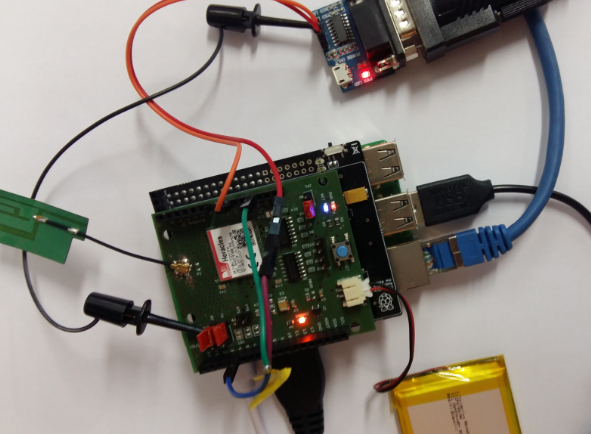

# RASPBERRY PI 3


## Board description

See https://docs.microsoft.com/en-us/windows/iot-core/learn-about-hardware/pinmappings/pinmappingsrpi for characteristics.

## Heracles modem
[Heracles shield](HeraclesShield.md) is used to connect the device to the Live Objects platform via a MQTT connection.


## First Install

### Micro SDHC Configuration

* Download NOOBS (https://www.raspberrypi.org/downloads/noobs/).
* Unzip The file NOOBS_v2_8_2.zip.
* Drag and drop of the content NOOBS_v2_8_2 directory to Micro SDHC drive.
* Insert the micro SD on the Raspberry pi Board.

### Connectivity

* Plug the screen onto the HDMI connector
* Plug an USB Keyboard.
* Plug an USB mouse.
* Connect an Ethernet cable to access local network.
* Connect the power suply.

### Rasberry Pi start

On the first power on, **install Rasbian** *"Recommanded"*.
Restart Raspberry PI (Power OFF, power ON).
Open a session:

|       | UserName | pwd           |
| ----- | -------- | ------------- |
| User  | **pi**   | **raspberry** |
| Admin | **root** | **raspberry** |


##### Configure connection SSH
* **sudo raspi-config**
* Select **5 Interfacing Options**
* Select **P2 SSH**
* Clic on **Oui** then **OK**

##### Configure *UART0* (**/dev/ttyAMA0**)
By default UART0 is used for the Bluetooth communication. It must be deactivated to can use this serial ligne for communication with Heracles modem board.
Open an admin session.
Modify the following file with *geany* editor:
* **/boot/config.txt**, add:
```
# disable Bluetooth function
dtoverlay = pi3-disable-bt
```
*  **/boot/cmdline.txt**, suppress ***console=serial,115200*** :

```
dwc_otg.lpm_enable=0 console=serial0,115200 console=tty1 root=/dev/mmcblk0p7 rootfstype=ext4 elevator=deadline fsck.repair=yes rootwait splash plymouth.ignore-serial-consoles
```

##### Linux cmds

| cmd                          | description                                |
| ---------------------------- | ------------------------------------------ |
| sudo raspi-config            | *Configuration of the system*              |
| sudo apt-get install cutecom | *Install the serial terminal **cutecom***  |
| sudo apt-get install cmake   | *Install the makefile generator **cmake*** |
| sudo root psswd              | *Create or change the root password*       |
| geany                        | *Open text editor*                         |

---

## Required hardware

* Raspberry Pi 3 board.
* Micro SDHC 32GB.
* Screen, Keybooard, mouse.
* HDMI cable.
* Power supply USB 5V.
* Ethernet cable RJ45.
* Cooking hacks shield (description [here]( https://raspberrypi.stackexchange.com/questions/34918/raspberry-pi-gpio-pin-layout-cooking-hacks-shield)).
* Heracles Modem shield.
* Battery Lithium-ion 3.7V for Heracles Modem shield.

## Required software

* winSCP.
* Teraterm.
* [LiveObjects account](http://liveobjects.orange-business.com).

## Building the sample

To build and run the sample application:

* Plug the Heracles modem shield to Cooking hacks shield.
* Plug the Cooking hacks shield to the Raspberry Pi 3 board.



* Connect the pin D4 (reset) of the Heracles modem to the 3.3V pin.
* Set strap ***Tx*** (D1) of the Heracles Shield on *Others*
* Set strap ***Rx*** (D0) of the Heracles Shield on *Others*
* Power On the Raspberry Pi 3 board.
* Open an LXTerminal
  * Update the date (**sudo date *MMJJHHMNAAAA***)
  * Add the write access onto the Serial port (**sudo chmod 666 /dev/ttyAMA0**)
  * Recover the IP address for the *winSCP* and *SSH* connection (**ifconfig**)
* From PC windows :
  * Connect to the Linux board with **winSCP** and tansfer the application files and directories as defined in [§Transfert project to a Linux device board](LinuxApplication.md).
  * Open a SSH connection with Teraterm as defined in [§Compilation](LinuxApplication.md).
  * In file [LinuxSerialImpl.c](..\LiveBooster-LinuxApp\LinuxImpl\LinuxSerialImpl.c) verify the PORTNAME declaration
```c
       #define PORTNAME "/dev/ttyAMA0"
```

* From the SSH session or directly on the board:
  * Goto the directory /home/LiveBooster/build.
  * create the makefile if not made (**cmake ..**)
  * Clean and compile application (**make clean; make**)
  * Run the application (**bin/Linux_test**)
* Connect to the [LiveObjects](http://liveobjects.orange-business.com) platform. Select **parc**, select **Manage/MQTT**. Verify than the Auto-created device **urn:lo:nsid:LiveBooster:test** is connected.
