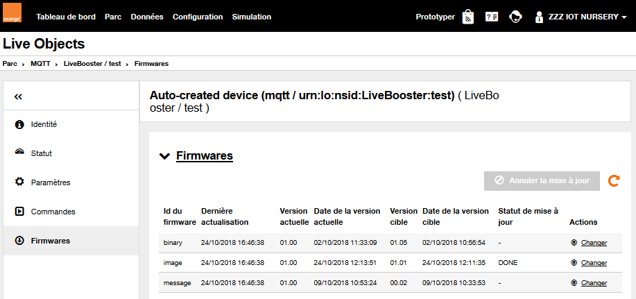
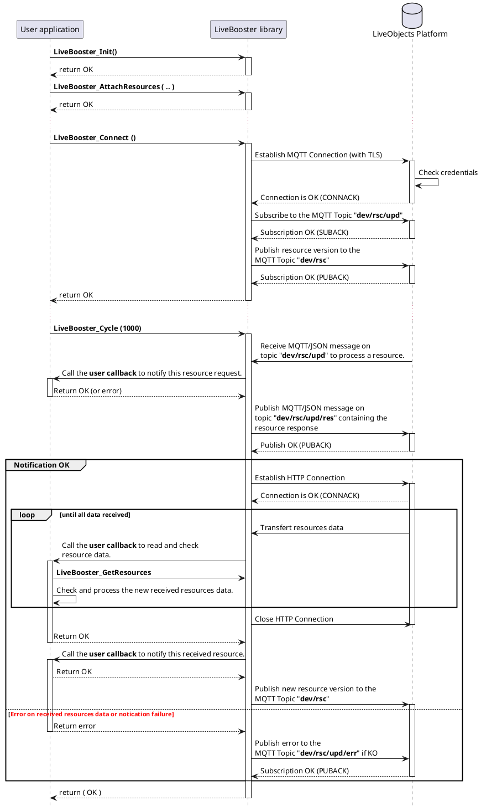

# Resources

The device can declare one set of one or several Live Objects "resources".

Then, Live Objects platform can track the changes of the current value of the resources, and allow users to set different target values for those resources.
If the resources are accepted by the device, a new HTTP connection is open and Live Objects will then send the resources on the device once it's connected on and available.

## Attach a set of resources
The application shall declare/attach only one set of resources to the LiveBooster library by calling the function:

```c
int LiveBooster_AttachResources(const LiveBooster_Resource_t* rsc_ptr,
                                int32_t rsc_nb,
                                LiveBooster_CallbackResourceNotify_t ntfyCB,
                                LiveBooster_CallbackResourceData_t dataCB);
```
* *"ntfyCB"* is a pointer to a callback function called when download operation is requested or completed by LiveObjects server.
* *"dataCB"* is a pointer to a callback function called when data is ready to be read.

In the sample application:

```c
res = LiveBooster_AttachResources(appv_set_resources, SET_RESOURCES_NB,
                                  main_cb_rsc_ntfy, main_cb_rsc_data);
```
Where:
1. The set of resources is defined by an array of *LiveBooster_Resource_t* elements.

In the sample application:

```c
// definition of identifier for each kind of commands
#define RSC_IDX_IMAGE       1
#define RSC_IDX_MESSAGE     2

// Set of resources
LiveBooster_Resource_t appv_set_resources[] = {
  { RSC_IDX_IMAGE,   "image",   appv_rv_image,   sizeof(appv_rv_image) - 1 },
  { RSC_IDX_MESSAGE, "message", appv_rv_message, sizeof(appv_rv_message) - 1 } // resource used to update appv_status_message
};
#define SET_RESOURCES_NB (sizeof(appv_set_resources) / sizeof(LiveBooster_Resource_t))
```

And the resources may be defined and initialized as:

```c
char appv_rv_image[10]         = "01.00";
char appv_rsc_image[10 * 1024] = "";

char appv_rv_message[10]    = "01.00";
char appv_rsc_message[1024] = "";

```

2. The application specifies :
* a callback function (of type *LiveBooster_CallbackResourceNotify_t*) which will be called by the LiveBooster library when :
  * request is received from the Live Objects platform to warn the device than a new resource is ready to transfer,
  * the resource is transferred without error.
* a callback function (of type *LiveBooster_CallbackResourceData_t*) which will be called cyclically by the LiveBooster library until all resources data are received from the Live Objects platform to change the current resources value.

```c
LiveBooster_ResourceRespCode_t main_cb_rsc_ntfy (uint8_t state,
                                                 const LiveBooster_Resource_t* rsc_ptr,
                                                 const char* version_old, const char* version_new,
                                                 uint32_t size) {
	LiveBooster_ResourceRespCode_t ret = RSC_RSP_OK; // OK to update the resource

  if ((rsc_ptr) && (rsc_ptr->rsc_uref > 0) && (rsc_ptr->rsc_uref <= SET_RESOURCES_NB)) {
    if (state) {
      if (state == 1) { // Completed without error
        // Update version
         strncpy((char*)rsc_ptr->rsc_version_ptr, version_new, rsc_ptr->rsc_version_sz);
      }
      else {
      	  ret = RSC_RSP_ERR_INTERNAL_ERROR;
      }
      appv_rsc_offset = 0;
      appv_rsc_size = 0;
    }
    else { // Begin of resource request
      appv_rsc_offset = 0;
      ret = RSC_RSP_ERR_NOT_AUTHORIZED;
      switch (rsc_ptr->rsc_uref ) {
        case RSC_IDX_MESSAGE:
          if (size < (sizeof(appv_rsc_message) - 1)) {
            ret = RSC_RSP_OK;
          }
          break;
        case RSC_IDX_IMAGE:
          if (size < (sizeof(appv_rsc_image) - 1)) {
            ret = RSC_RSP_OK;
          }
          break;
      }
      if (ret == RSC_RSP_OK) {
        appv_rsc_size = size;
      }
      else {
        appv_rsc_size = 0;
      }
    }
  }
  else {
    ret = RSC_RSP_ERR_INVALID_RESOURCE;
  }
  return ret;
}
```
```c
int main_cb_rsc_data (const LiveBooster_Resource_t* rsc_ptr, uint32_t offset)
{
  int ret;

  if (rsc_ptr->rsc_uref == RSC_IDX_MESSAGE) {
    char buf[40];
    if (offset > (sizeof(appv_rsc_message) - 1)) {
      return -1;
    }
    ret = LiveBooster_GetResources(rsc_ptr, buf, sizeof(buf) - 1);
    if (ret > 0) {
      if ((offset + ret) > (sizeof(appv_rsc_message) - 1)) {
        return -1;
      }
      appv_rsc_offset += ret;
      memcpy(&appv_rsc_message[offset], buf, ret);
      appv_rsc_message[offset + ret] = 0;
    }
  }
  else if (rsc_ptr->rsc_uref == RSC_IDX_IMAGE) {
    if (offset > (sizeof(appv_rsc_image) - 1)) {
      return -1;
    }
    int data_len = sizeof(appv_rsc_image) - offset - 1;
    ret = LiveBooster_GetResources(rsc_ptr, &appv_rsc_image[offset], data_len);
    if (ret > 0) {
      if ((offset + ret) > (sizeof(appv_rsc_image) - 1)) {
        return -1;
      }
      appv_rsc_offset += ret;
    }
    else {
    }
  }
  else {
    ret = -1;
  }
  return ret;
}
```

## Get a resource data
The application shall read the resource data received from the Live Objects platform by calling the function:

```c
int LiveBooster_GetResources(const LiveBooster_Resource_t* rsc_ptr,
                             char* data_ptr,
                             int data_len);
```
This function is called by the callback function (of type *LiveBooster_CallbackResourceData_t*).

## Push a resources response
The LiveBooster library notifies the Datavenue Live Objects platform, by publishing a MQTT message on the dev/rsc/res topic, that the command is acknowledged.

## Use of Live Objects Portal to set/change resources
On the Datavenue Live Objects portal, the user can create or repeat a "ressource" on its connected device:



## Sequence diagram


