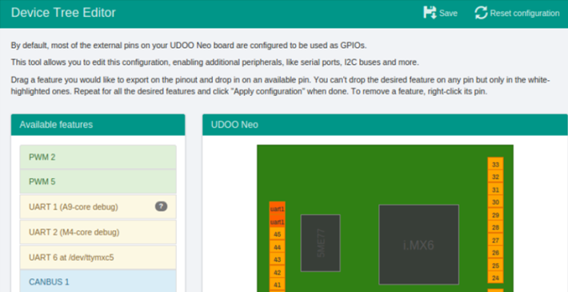

# UDOO Neo


## Board description

See https://www.udoo.org/docs-neo/Software_&_Operating_Systems/UDOObuntu.html for documentation.

## Heracles modem
[Heracles shield](HeraclesShield.md) is used to connect the device to the Live Objects platform via a MQTT connection.


## First Install

### Configuration micro SD
* See [here](https://www.udoo.org/docs-neo/Getting_Started/Create_a_bootable_MicroSD_card_for_UDOO_Neo.html) to create a bootable Micro SD.
* Insert the micro SD on the UDOO Neo Board.

### Connectivity


* Plug the screen onto the HDMI connector
* Plug the USB Hub onto the USB connector
* Plug an USB Keyboard
* Plug an USB mouse
* Connect an Ethernet cable to access local network
* Connect the power suply

### Start UDOO Neo

Open a session:

|       | UserName   | pwd        |
| ----- | ---------- | ---------- |
| User  | **udooer** | **udooer** |
| Admin | **root**   | **ubuntu** |


##### Configure *UART6* (**/dev/ttymxc5**)
* Open **Device Tree Editor** (Menu -> Peferences -> Device Tree Editor)
* Enter Password **udooer**



* Clic UART6 drag and drop on pin 30 31 32 33 (pin number is replaced by par UART6)
* Clic on **Save** to record the modification.
* Exit and reboot the system.

##### Linux cmds

| cmd                          | description                                |
| ---------------------------- | ------------------------------------------ |
| sudo apt-get install cutecom | *Install the serial terminal **cutecom***  |
| sudo apt-get install cmake   | *Install the makefile generator **cmake*** |

---

## Required hardware

* Udoo Neo board.
* Micro SD Bootable.
* Screen, Keybooard, mouse.
* micro HDMI/HDMI cable.
* Power supply USB 7.5V.
* Ethernet cable RJ45.
* Heracles Modem shield.
* Battery Lithium-ion 3.7V for Heracles Modem shield.
* 2 cables for connection RX/TX with Heracles modem shield.

## Required software

* winSCP.
* Teraterm.
* [LiveObjects account](http://liveobjects.orange-business.com).

## Building the sample

To build and run the sample application:

* Plug the Heracles modem shield to Udoo Neo board.


* Connect the pin **D4** (reset) of the Heracles modem to pin 3.3V.
* Connect the pin **TX** of the Heracles modem to **UART_6_TX_DATA** (pin 31) of the UDOO Neo (see [UART](https://www.udoo.org/docs-neo/Hardware_&_Accessories/UART_serial_ports.html)).
* Connect the pin **RX** of the Heracles modem to**UART_6_RX_DATA** (pin 30) of the UDOO Neo(see [UART](https://www.udoo.org/docs-neo/Hardware_&_Accessories/UART_serial_ports.html)).
* Power On the UDDO Neo board.
* Open an LXTerminal
  * Update the date (**sudo date *MMJJHHMNAAAA***)
  * Add the write access to the Serial port (**sudo chmod 666 /dev/ttymxc5**)
  * Recover the IP address for the *winSCP* and *SSH* connection (**ifconfig**)
* From PC windows :
  *  Connect to the Linux Udoo Neo with **winSCP** and tansfert the application files and directories as defined in [§Transfert project to a Linux device board](LinuxApplication.md).
  * Open a connection SSH from Teraterm tools as defined in [§Compilation](LinuxApplication.md).
  * In file [LinuxSerialImpl.c](..\LiveBooster-LinuxApp\LinuxImpl\LinuxSerialImpl.c) verify the PORTNAME declaration
```c
       #define PORTNAME "/dev/ttymxc5"
```

* From a SSH session or directly on the board:
  * Goto the directory Desktop/LiveBooster/build.
  * create the makefile if not made (**cmake ..**)
  * Clean and compile application (**make clean; make**)
  * Run the application (**bin/Linux_test**)
* Connect to the [LiveObjects](http://liveobjects.orange-business.com) platform. Select **parc**, select **Manage/MQTT**. Verify than the Auto-created device **urn:lo:nsid:LiveBooster:test** is connected.
