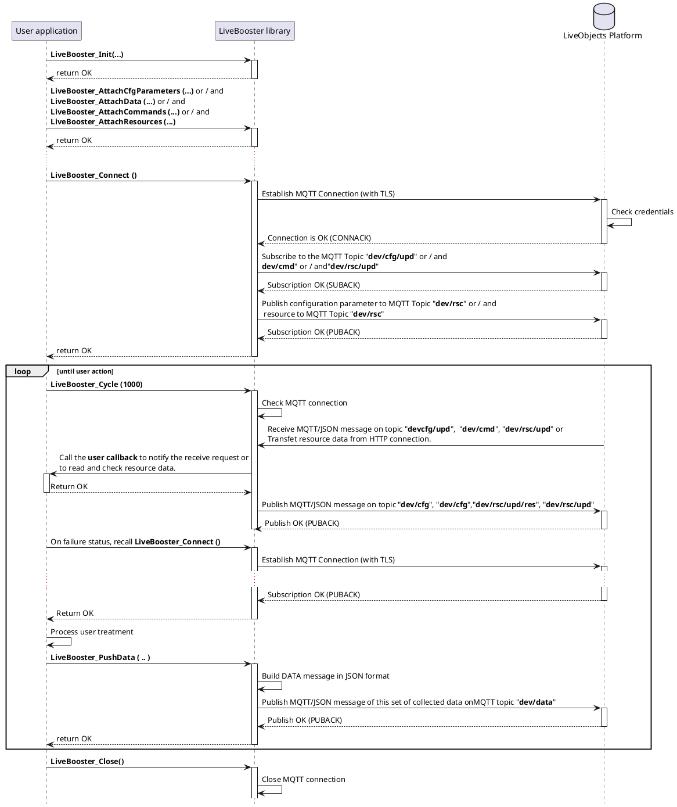

# User Application

This chapter described how make a user application Switch the LiveBooster library.
This example can be used for the three environments (Arduino, mbed and Linux).


### 1. Init

The application shall give initialization parameters to the LiveBooster library by calling the function:

```c
int LiveBooster_Init(char *deviceId,
                     unsigned long long apiKeyP1,
                     unsigned long long apiKeyP2,
                     SerialInterface* serial,
                     TimerInterface* timer,
                     DebugInterface *debug);

```
* *"deviceId"* is a pointer to the URL of the device deffined as follow : `"urn:lo:nsid:{namespace}:{id}"` (see [§Device Identifier (URN)](https://liveobjects.orange-business.com/doc/html/lo_manual.html) in chapter MQTT interface).
* *"apiKeyP1"* is the High 32bits part of the API Key (refer to  [API Key creation](../README.md)).
* *"apiKeyP2"* is the Low 32bits part of the API Key.
* *"serial"* is a pointer of the serial instance.
* *"timer"* is a pointer of the timer instance.
* *"debug"* is a pointer of the debug instance.
* return always **OK**

### 2. Attach...

The device can be used to **configure Parameters**, or to **Collect data**, or to send **command**, or to get **resources**.
For this, the application must call the following functions (*one or several*):

```c
int LiveBooster_AttachCfgParameters  (const LiveBooster_Param_t* ptrParam,
                                      uint32_t  nbPparam,
                                      LiveBooster_CallbackParams_t callback);
```

**LiveBooster_AttachCfgParameters** is described [here](ConfigurationParameters.md).

```c
int LiveBooster_AttachData(const char* stream_id,
                           const char* model,
                           const char* tags,
                           const char* timestamp,
                           const LiveBooster_GpsFix_t* gps_ptr,
                           const LiveBooster_Data_t* data_ptr,
                           int32_t data_nb);
```

**LiveBooster_AttachData** is described [here](CollectedData.md).

```c
int LiveBooster_AttachCommands (const LiveBooster_Command_t* ptrCmd,
                                int32_t nbCcmd,
                                LiveBooster_CallbackCommand_t callback);
```

**LiveBooster_AttachCommands** is described [here](Command.md).

```c
int LiveBooster_AttachResources(const LiveBooster_Resource_t* rsc_ptr,
                                int32_t rsc_nb,
                                LiveBooster_CallbackResourceNotify_t ntfyCB,
                                LiveBooster_CallbackResourceData_t dataCB);
```

**LiveBooster_AttachResources** is described [here](Resources.md).

All theses functions return **OK** if success or a [negative value](LiveBoosterErrors.md) if an errors occurs.


### 3. Connect

The Application must call function
```c
int LiveBooster_Connect(void);
```
to process the following actions :
* initialize client,
* connect to MQTT server,
* subscribe to MQTT topic :
  * `"dev/cfg/upd"` if **configuration parameters** is used.
  * `"dev/cmd"` if **command** is used.
  * `"dev/rsc/upd"` if **resources** is used.
* publish configuration parameters to MQTT topic  `"dev/cfg/upd"` is **configuration** is used.
* publish resources to MQTT topic  `"dev/rsc"` is **resources** is used.

The Authorized MQTT actions from the device are defined in [$Summary](https://liveobjects.orange-business.com/doc/html/lo_manual.html) in chapter "Device" mode.
this function return **OK** if success or a [negative value](LiveBoosterErrors.md) if an errors occurs.


### 4. Cycle

The Application must call function cyclically at a period defined in parameter

```c
int LiveBooster_Cycle(int timeout_ms)
```

to process the following actions :
 * check the connection MQTT.
 * process the management of the configurations parameters modification if **configuration parameters** is used.
 * process the management of the resource transfer from Live Objects if **resources** is used.
 * Get and process some MQTT/JSON messages received from the LiveObject Server.

This function return **OK** if success or a [negative value](LiveBoosterErrors.md) if an errors occurs.
In case of Error the MQTT is automatically disconnected.
**It is the responsibility of the user to re-establish the MQTT connection** by calling `LiveBooster_Connect();`.

When the **Collected data** is used, the application collect the data from the device and call the following function to send the data to Live Objects

```c
int LiveBooster_PushData(int data_hdl);
```
* *"data_hdl"* is the handler id returned by **`LiveBooster_AttachData`** function.


### 5. Close

The user can close the MQTT connection by calling the following function

```c
void LiveBooster_Close(void);
```


## Sequence diagram



## Specificity related to the environment

### Arduino

All Arduino programs uses two mandatories functions:

```c
void setup() { ... }

void loop() { ... }
```

**setup** is used to make the initializations.
**loop** is used to run the application.

See  [LiveBooster-ArduinoApp.ino](..\LiveBooster-ArduinoApp\LiveBooster-ArduinoApp.ino) example.

### Mbed

A Mbed application must always defined in a thread and the stack size must be declared for this thread.

```c
/* contains the user application */
static void thread_main(const void * args) { ... }

/* Stack size fixed to 16K octets */
osThreadDef(thread_main, osPriorityNormal, 16 * 1024);

int main(void)
{
    /* Create and start thread */
	osThreadCreate(osThread(thread_main), NULL);
}
```

See  [Mbed_test.cpp](..\LiveBooster-MbedApp\MbedApp\Mbed_test.cpp) example.

### Linux

The application is defined in the main function.

```c
int main(void) { ... }
```

See  [Linux_test.c](..\LiveBooster-LinuxApp\LinuxApp\Linux_test.c) example.
