# LiveBooster Library

Please refer to the [Changelog](ChangeLog.md) to check the latest change and improvement.

---


## Table of content

- [INTRODUCTION](#introduction)
  - [Document purpose](#document-purpose)
  - [Reference documents](#reference-documents)
- [OVERVIEW](#overview)
  - [What is Live Objects ?](#what-is-live-objects)
  - [Tested Hardware](#tested-hardware)
  - [LiveBooster](#livebooster)
    - [Architecture](#architecture)
    - [Interfaces](#interfaces)
- [GETTING STARTED](#getting-started)
  - [Access to Live Objects](#access-to-live-objects)
    - [Log in](#log-in)
    - [API Key creation](#api-key-creation)
    - [Add equipment](#add-equipment)
- [MAKE APPLICATION](#make-application)
  - [Arduino](#arduino)
  - [Mbed](#mbed)
  - [Linux](#linux)
- [LIBRARY FEATURES](#library-features)
	- [Configuration Parameters](#configuration-parameters)
	- [Collected Data](#collected-data)
	- [Commands](#commands)
	- [Resources](#resources)
- [EXTERNAL LIBRARIES](#external-libraries)
  - [jsmn](#jsmn)
  - [paho mqtt](#paho-mqtt)
- [APPLICATION CONTROL](#application-control)
  - [Live Objects Portal](#live-objects-portal)
  - [Live Objects Swagger](#live-objects-swagger)
- [ANNEXE](#annexe)
  - [LiveBooster Error](#livebooster-error)

---

## INTRODUCTION

### Document purpose

  This document is a complete guide to LiveBooster and go through the following:
* Overview
* Getting started
* Detailed Features
* Additional Information

### Reference documents
| #   | Origin | Title                                                                    |
| --- | ------ | ------------------------------------------------------------------------ |
| 1   | Orange | https://liveobjects.orange-business.com/doc/html/lo_manual.html (2.0.22) |


## OVERVIEW

### What is Live Objects ?

**Live Objects** is one of the products belonging to Orange [Datavenue service suite](https://liveobjects.orange-business.com).

**Live Objects** is a software suite for IoT / M2M solution integrators offering a set of tools to facilitate the interconnection between **devices** or **connected « things »** and business applications.

The main features provided are:
* **Connectivity interfaces** (public and private) to collect data, send command or notification from/to IoT/M2M devices,
* **Device management** (supervision, configuration, resources, etc.),
* **Message Routing** between devices and business applications,
* **Data Management** and Data Storage with Advanced Search features.

Read [Datavenue Live Objects - complete guide](https://liveobjects.orange-business.com/doc/html/lo_manual.html) to have a full description of services and architecture provided by Live Objects platform.

## Tested hardware

The LiveBooster library is designed to be easily integrated with different targets or environments.
An [Heracles shield](Docs/HeraclesShield.md) is used to test a **MQTT connection** between the targets and Live Objects.
It has been tested on targets/boards with all following features:
* [Configuration Parameters](#configuration-parameters)
* [Collected Data](#collected-data)
* [Commands](#commands)
* [Resources](#resources)

| Targets                                            | Environments | Results      |
| -------------------------------------------------- | ------------ | ------------ |
| Arduino M0 Pro                                     | Arduino      | PASSED       |
| Arduino MEGA ADK                                   | Arduino      | FAILED **°** |
| STM32 Nucleo-144 (F746ZG)                          | Nucleo       | PASSED       |
| STM32 Nucleo-64 (L476RG)                           | Nucleo       | PASSED       |
| chipKIT uC32 (Microchip PIC32MX340F512H processor) | Microchip    | PASSED       |
| Udoo NEO                                           | Linux        | PASSED       |
| Raspberry Pi 3 B+                                  | Linux        | PASSED       |
**°** Not enough SRAM memory (8 ko max).

### LiveBooster
The **LiveBooster** is a library to help developers to make an easy usage of the Live Objects platform.

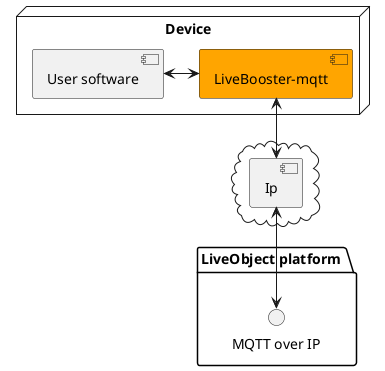

The Live Objects platform is able to manage different formats (MQTT, HTTP, …) and several low level protocols (SMS, IP, …). The Live Objects IoT Soft Box is designed to work with MQTT over TCP w/wo TLS.

The IoT Soft Box can run on devices connected to Internet through Ethernet, Wifi, GPRS or any other IP connection. It doesn’t embed SSL/TLS capability. The connection layer (Wifi library, GPRS shield, Live Booster Heracles modem, …) should manage the SSL/TLS layer in order to enable data transfer security.

The library (LiveBooster-mqtt) is linked to the following third-party existing libraries:
* [Embedded MQTT C/C++ Client Libraries (eclipse paho)](http://www.eclipse.org/paho/clients/c/embedded/). This library is available [here](https://github.com/eclipse/paho.mqtt.embedded-c).
* [JSMN](https://zserge.com/jsmn.html), a simple C library only used to parse the received JSON messages. The JSMN library is available [here](https://github.com/zserge/jsmn).

#### Architecture

The LiveBooster library provides abstract interfaces for low-level layers (serial communication, timer, and an optional trace output for debug), in order to be easily adapted for different targets. The internal library's layers are themselves connected through abstract interfaces, so it will be easy to remove/replace a layer of the library.


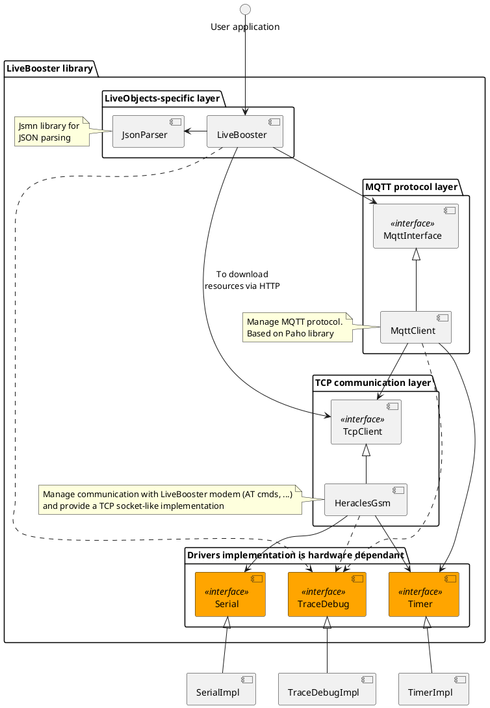

#### Interfaces

The user application must embedded the LiveBooster Library with an include of [LiveBooster.h](LiveBooster-C-Library/LiveBooster.h)
which itself include :
* `src/LiveBooster/LiveBoosterInterface.h`
* `src/serial/SerialInterface.h`
* `src/timer/TimerInterface.h`
* `src/traceDebug/DebugInterface.h`

The LiveBooster library define the fonctions usable by the user software application to connect an equipment and exchange data with the Live Objects platform.
* [src\LiveBooster\LiveBoosterInterface.h](LiveBooster-C-Library\src/LiveBooster/LiveBoosterInterface.h)
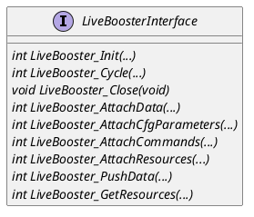

The LiveBooster library define **3 abstracts interfaces** which must be **implemented** by the **user software application** (dependent of the target environment) :
* [src/serial/SerialInterface.h](LiveBooster-C-Library/src/serial/SerialInterface.h)
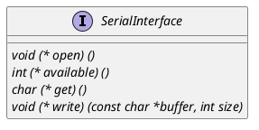
* [src/timer/TimerInterface.h](LiveBooster-C-Library/src/timer/TimerInterface.h)
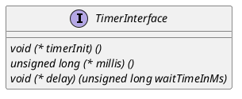
* [src/traceDebug/DebugInterface.h](LiveBooster-C-Library/src/traceDebug/DebugInterface.h)
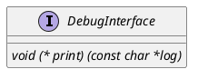


## GETTING STARTED

### Access to Live Objects

In order to use Live Objects, you need an account on the service.
**1.** Go to Live Objects portal (https://liveobjects.orange-business.com/).


**2.** Click on ‘Discover Offer’ button (or Sign Up) and fill the form, checking option ‘I am requesting a free discover offer account for 3 months limited to 10 devices’.

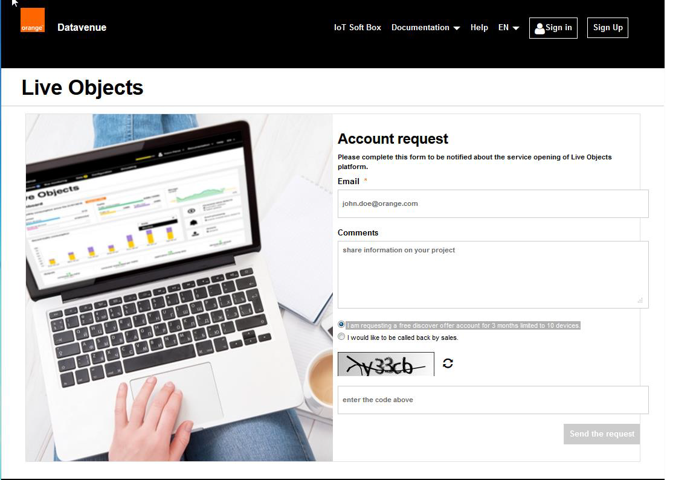

**3.** Then you will receive an e-mail to activate your Live Objects account.

```
Hello,

You just subscribed to Live Objects portal.

Please, use this link to activate your account 'john' and define your password.

'john' Account activation

Thank you for your trust.

Orange Business Service Customer Support.

This is an automatically generated email, please do not reply.
```

**4.** Follow the link, fill the form, and click on ‘Validate’.
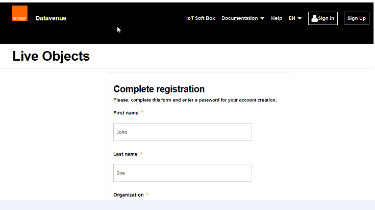

**5.** Now, you can go back to the Datavenue Live Objects portal and sign in. Once logged, select the ‘configuration’ tab to create a new API key.


#### Log in

To log in the Live Objects web portal, goto [liveobjects.orange-business.com](liveobjects.orange-business.com) using your web-browser:

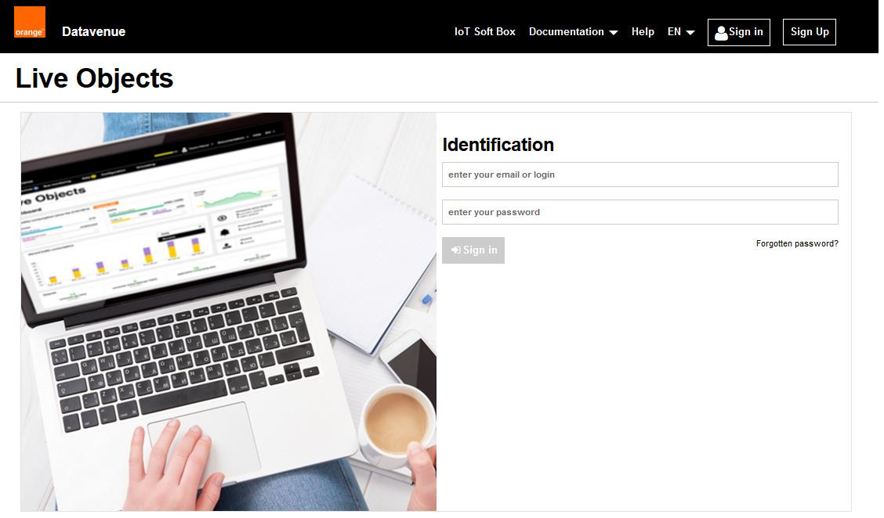

**1.** Fill the “Log in” form with your credentials:
* your email address,
* the password set during the activation phase,

**2.** Then click on the “Log in” button.
If the credentials are correct, a success message is displayed and you are redirected to your “home” page:

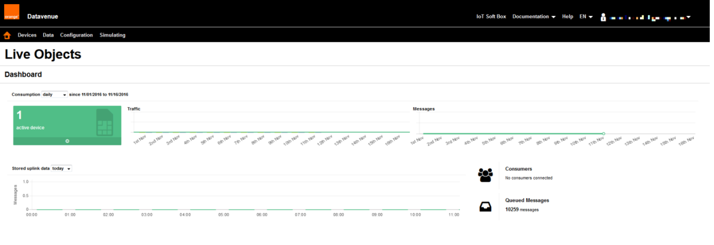

#### API Key creation

To get a device or an application communicating with Live Objects, you will need to create an API Key in the “Configuration” menu. On the left menu, click on "Api keys" and create a new API key. This key will be necessary to set up a connection with the public interfaces (MQTT and REST) of Live Objects.

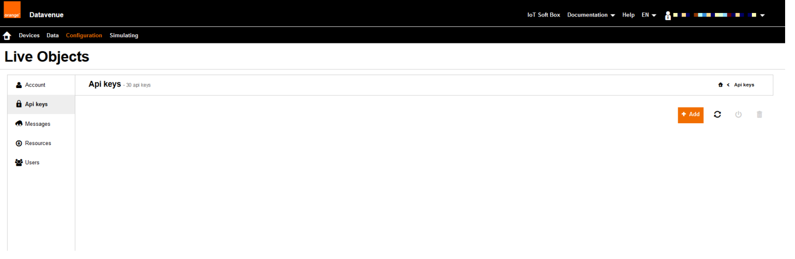

As a security measure, you cannot retrieve the API Key again after closing the API key creation results page. So, note it down to work with the MQTT client, during the scope of this getting started.
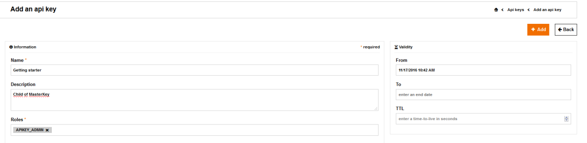
**Don't forget to copy this API key value** in a local and secure place during this operation.

#### Add Equipment

It is recommended to not create a new equipment via the following interface.

 

The equipment will be created automatically at the first connection between the device and the Live Objects platform.

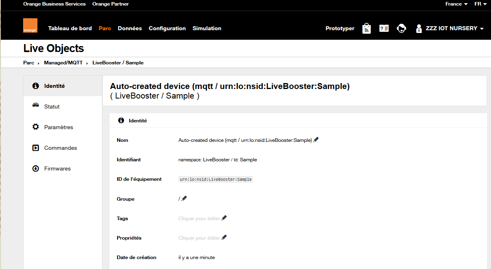


## MAKE APPLICATION

The description of an application model with the LiveBooster library is described [here](Docs/UserApplication.md).
The application is dependent of the target and the environment.

### Arduino

The environment to build an application on Arduino boards (**Arduino M0 pro**, **MEGA ADK**, **ChipKIT UC32**, ...) is described [here](Docs/ArduinoApplication.md).

### Mbed

The environment to build an application on Nucleo boards (**NUCLEO_F746ZG**, **NUCLEO_L476RG**, ...) is described [here](Docs/MbedApplication.md).

### Linux

The environment to build an application on Linux boards (**Raspberry Pi 3**, **UDOO Neo**, ...) is described [here](Docs/LinuxApplication.md).

## LIBRARY FEATURES

### Configuration Parameters

See description [here](Docs/ConfigurationParameters.md).

### Collected Data

See description [here](Docs/CollectedData.md).

### Commands

See description [here](Docs/Commands.md).

### Resources

See description [here](Docs/Resources.md).

## EXTERNAL LIBRARIES

Here is a list of the third-party libraries used to develop this library and their utilities:

### jsmn

[jsmn](https://github.com/zserge/jsmn) (pronounced like 'jasmine') is a minimalistic JSON parser in C. It can be easily integrated into resource-limited or embedded projects.

### paho mqtt

[paho mqtt](https://github.com/eclipse/paho.mqtt.embedded-c) is part of the Eclipse Paho project, which provides open-source client implementations of MQTT and MQTT-SN messaging protocols aimed at new, existing, and emerging applications for the Internet of Things.

## APPLICATION CONTROL

### Live Objects Portal

Using your Live Objects user account, go to [Live Objects Portal](https://liveobjects.orange-business.com/#/login).

### Live Objects Swagger

Go in [Live Objects Swagger User Interface](https://liveobjects.orange-business.com/swagger-ui/index.html).

## ANNEXE

### LiveBooster Error

All the liveBooster functions called by the user application return an integer status:
* **0** (OK) : no error has been detected.
* **Negative value** : an error has been detected (the errors list is available [here](Docs/LiveBoosterErrors.md)).

When an error is detected, the user program close the MQTT connection and terminate the software program.
